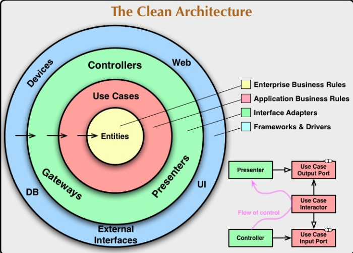
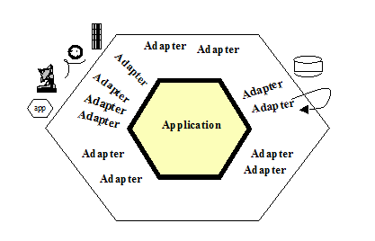
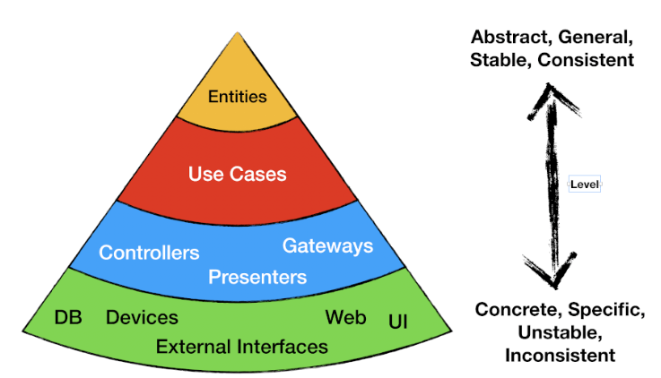

# Clean Architecture

## システム開発における課題

- 要件の複雑化
- ドキュメントが最新化されない、間に合わない
- コードがわかりずらい
- 影響範囲がわからない
- テストしずらい、自動化ができない
- 既存の~~くそ~~システムをマイクロサービス対応しろって言われても無理…

## Clean Architecture とは



- **ユースケース**中心のアーキテクチャスタイル
- Ports and Adapters パターン（別名:Hexagonal Architecture）  
    - 実装はTDD
    - テクノロジーとビジネスの分離



- **[SOLID原則に従う](doc/Solid_fixed.pptx)**

### レイヤーについて

中心に行けば行くほど、抽象的で安定



## サンプルコード

### 1.テクノロジーに依存しない

```cs
private IDILauncher diLauncher() {
    switch (Configuration["DI"])
    {
        case "LocalDILauncher": return new LocalDILauncher(); // データ = インメモリ, 処理 = プロダクト
        case "TestDILauncher": return new TestDILauncher(); // データ = 未使用, 処理 = モック
        case "ProductDILauncher": return new ProductDILauncher(); // データ = MYSQL, 処理 = プロダクト
        default:
            throw new InvalidOperationException("not found di launcher");
    }
}
```

### 2.単一責務原則＋ビジネスサービスの分離

before

```cs
public async Task<IActionResult> Get([FromRoute][Required] GetAccountDetailsRequest request)
{
    var input = new GetAccountDetailsInput(request.AccountId);
    try
    {
        var output = await _useCase.Execute(input);
        return Ok(output);
    }
    catch (AccountNotFoundException ex)
    {
        return NotFound(ex.Message);
    }
}
```

after

```cs
[HttpGet("{AccountId}", Name = "GetAccount")]
[ProducesResponseType(StatusCodes.Status200OK, Type = typeof(GetAccountDetailsResponse))]
[ProducesResponseType(StatusCodes.Status404NotFound)]
public async Task<IActionResult> Get([FromRoute][Required] GetAccountDetailsRequest request)
{
    var input = new GetAccountDetailsInput(request.AccountId);
    await _useCase.Execute(input);
    return _presenter.ViewModel;
}
```

## 所感

### メリット

- 美しい、メンテナンスしやすい
- テストしやすい、自動化が簡単
- アジャイル開発と相性がいい（ユーザーストーリーがコードに対応する）
- 技術資産として残せる(使い捨てじゃない)
- マイクロサービスにも対応できる

### デメリット

- スキル＆学習コスト
- 実装量は確実に増える
- MVCフレームワークと相性がいまいち
  - プレゼンテーション層のビューエンジンが既にある
  - 機能を増えることにつれ、コントローラーにユースケース詰めすぎる懸念がある

## 備考

参考文献

- [Clean Architecture Essentials](https://dev.to/ivanpaulovich/clean-architecture-essentials-5a0m)
- [実装クリーンアーキテクチャ](https://qiita.com/nrslib/items/a5f902c4defc83bd46b8)
- [Ports & Adapter](https://blog.tai2.net/hexagonal_architexture.html)